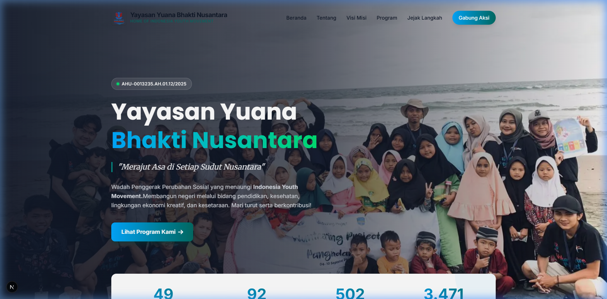

# Yayasan Yuana Bhakti Nusantara (Indonesia Youth Movement)

Website resmi untuk Yayasan Yuana Bhakti Nusantara (YBN), sebuah organisasi sosial berbadan hukum yang menaungi Indonesia Youth Movement (IYM). Platform ini berfungsi sebagai wadah inklusif dan terbuka bagi mereka yang peduli dan ingin berkontribusi pada pembangunan berkelanjutan di Indonesia.



## Tentang Proyek Ini

Website ini dirancang untuk menampilkan profil, visi-misi, serta berbagai program dan proyek yang telah dijalankan oleh IYM di seluruh Indonesia. Terdapat penjelasan lengkap mengenai:
- **Pilar Utama:** Pendidikan, Kesehatan, Lingkungan, Ekonomi Kreatif, dan Kesetaraan.
- **Peta Persebaran:** Menampilkan jangkauan program dan proyek di berbagai daerah.
- **Dampak (Stats):** Angka capaian relawan, proyek offline, program, dan followers.
- **SDGs (Sustainable Development Goals):** Komitmen terhadap target global.

## Teknologi yang Digunakan

Proyek ini dibangun menggunakan modern web stack yang fokus pada performa dan skalabilitas:
- **[Next.js](https://nextjs.org/)** (v16) - Framework React dari Vercel dengan fitur App Router.
- **[React](https://react.dev/)** (v19) - Library UI utama untuk membangun komponen.
- **[Tailwind CSS](https://tailwindcss.com/)** (v4) - Framework utility-first untuk styling.
- **TypeScript** - Menambahkan strict typing pada JavaScript.

## Cara Menjalankan Proyek di Lokal

Ikuti langkah-langkah berikut untuk menjalankan web ini di komputer Anda:

1. Pastikan Anda telah menginstal Node.js di sistem Anda.
2. Buka terminal dan arahkan ke direktori proyek.
3. Instal seluruh *dependencies*:
   ```bash
   npm install
   ```
4. Untuk memulai *development server*, jalankan:
   ```bash
   npm run dev
   ```
5. Buka [http://localhost:3000](http://localhost:3000) pada browser pilihan Anda untuk melihat hasilnya.

---

*Teruslah berkontribusi dan menciptakan dampak positif untuk negeri!*
